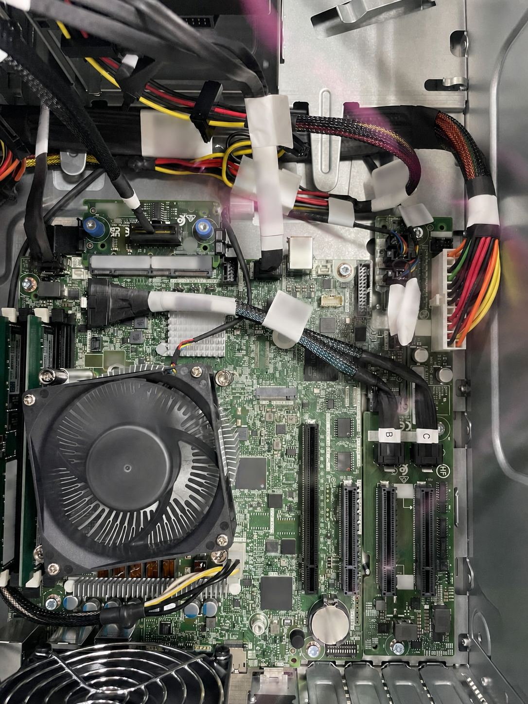
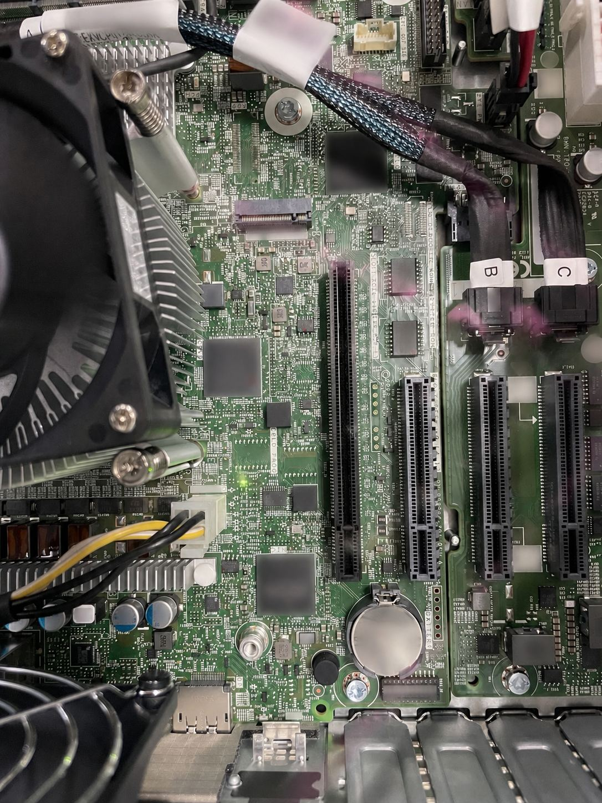
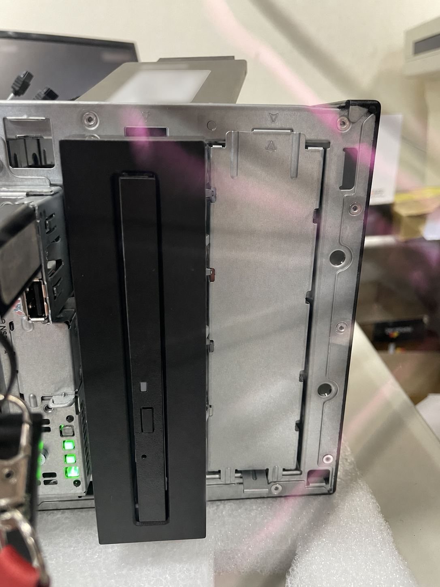
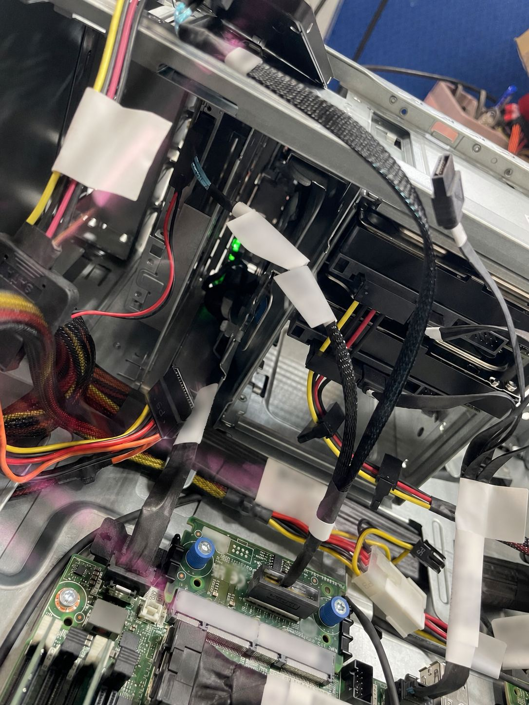
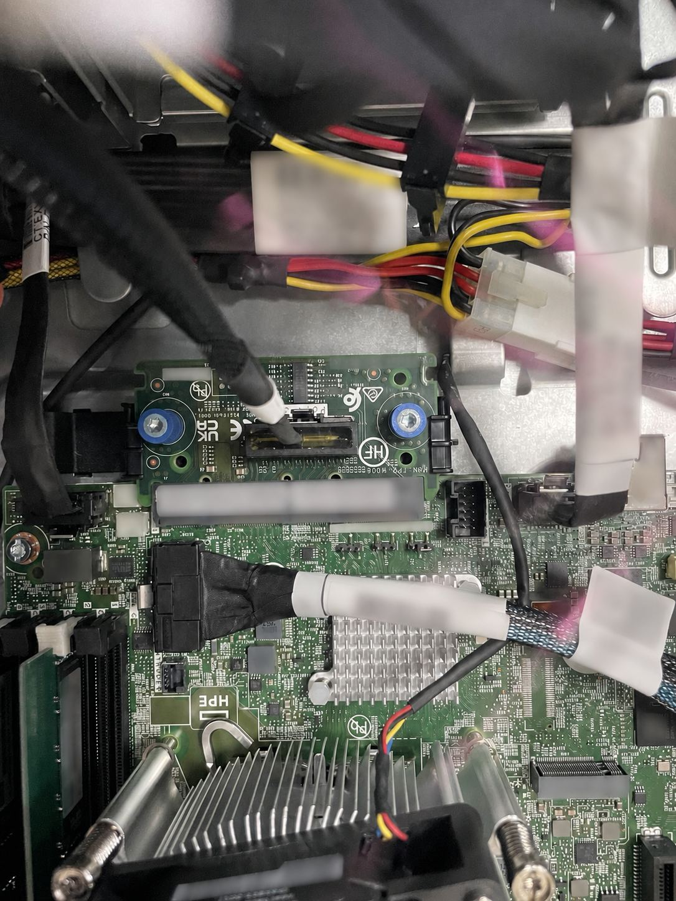

# HPE ProLiant ML30 Gen11：光碟機、M.2 與 iLO 專用網路埠擴充紀錄

## 摘要

HPE ProLiant ML30 Gen11 預設不一定包含 Slimline 光碟機所需的托架／線材，也不一定有獨立的 iLO 管理網路埠。實機擴充時應把「裝置」與「Enablement Kit」分開採購：安裝內接光碟機需要 **P65102-B21**；若要取得獨立 iLO 網路埠、模組上的一個 M.2 SSD 插槽及序列埠線材，則需要 **P65741-B21**。部分機型與擴充組態還必須搭配 **P65106-B21** 前置 PCI 風扇與導風罩。

本文依 HPE 官方 QuickSpecs 與 ML30 Gen11 Server User Guide 核對，並以本次實機照片記錄安裝位置。選配規則會隨機箱、預組態型號與其他 PCIe 選項而異；下單前仍應以機器產品編號、所在地區最新 QuickSpecs 與 HPE 核准組態工具複核。

## 本次實機觀察

上圖為側蓋拆除後的主機板全貌，可看到 CPU、記憶體、PCIe 插槽與後方擴充模組區。照片只用來辨識位置；零件相容性與必需條件仍以 HPE 官方文件為準。

PCIe 插槽旁可見主機板上的模組接頭區。拆裝前應關機、拔除所有電源線並採取防靜電措施，不要只依照片判斷接頭方向。

## 光碟機：ODD 與 Enablement Kit 是兩個項目

HPE QuickSpecs 將內接 Slimline ODD 列為選配，並明確註明：選擇 ODD 時需要 **HPE ProLiant ML30 Optical Disk Drive Slimline Enablement Kit（P65102-B21）**。也就是說，只購買 9.5 mm SATA DVD-ROM／DVD-RW 裝置，通常不足以完成安裝；還要確認托架、面板與對應線材是否已隨機器或套件提供。

官方列出的相容光碟機包括：

| 項目 | HPE 料號 | 用途／注意事項 |
|---|---|---|
| ML30 Optical Disk Drive Slimline Enablement Kit | `P65102-B21` | 選擇內接 ODD 時必需；占用 1 個 media bay |
| 9.5 mm SATA DVD-ROM Optical Drive | `726536-B21` | 仍需搭配 `P65102-B21` |
| 9.5 mm SATA DVD-RW Optical Drive | `726537-B21` | 仍需搭配 `P65102-B21` |
| Mobile USB DVD-RW Optical Drive | `701498-B21` | 外接 USB 選項，不使用內接 Slimline ODD bay |

實機前方已裝入 Slimline 光碟機；右側仍可看到另一個機箱開口／遮板。不要把「機箱有開口」當成托架與線材已隨附的證據。

安裝後應確認資料線與電源線完全就位、不會碰到風扇，並依原廠走線固定，避免側蓋或導風罩壓到線材。

## M.2／iLO／NIC／COM Port Kit

**HPE ProLiant ML30 Gen11 iLO/NIC/M.2/COM Port Kit（P65741-B21）**包含：

- 一個 dedicated iLO module
- 模組上的一個 M.2 SSD 插槽
- 一條 serial port cable

這個套件的名稱容易造成誤解：它不是讓 ML30 Gen11「開始具備 iLO」，而是增加 **iLO Dedicated Network Port**，同時提供 M.2 插槽與序列埠連接。若只需要遠端 iLO 管理，原機可使用 embedded NIC 1 的 Shared Network Port，不一定要買此套件；若要求管理流量使用獨立實體埠，才需要 dedicated iLO port 與此套件。

照片中可見實機的擴充模組及其 M.2 SSD。SSD 型號、容量與相容性仍應依 HPE 最新選配清單確認，不能只以 M.2 外形相同判定可用。

## iLO Dedicated Network Port 與 Shared NIC 的差異

| 比較項目 | iLO Dedicated Network Port | Embedded NIC 1 Shared Network Port |
|---|---|---|
| 實體網路介面 | 獨立、只供 iLO 管理流量使用 | iLO 管理流量與作業系統／正式流量共用 NIC 1 |
| ML30 Gen11 所需硬體 | 需要 `P65741-B21` | 原機預設可用，不因缺少 dedicated port 而失去 iLO |
| 網路隔離 | 可接獨立管理交換器或管理 VLAN，實體隔離較清楚 | 減少網路埠與佈線，但管理與正式流量共用介面 |
| 預設狀態 | 安裝模組後仍需依 User Guide 在 UEFI／iLO 設定中啟用 | ML30 Gen11 User Guide 指出 NIC 1／iLO shared port 是預設 iLO port |

安裝 dedicated module 後，依 HPE ML30 Gen11 User Guide 的啟用流程：

1. 開機時按 `F9` 進入 UEFI System Utilities。
2. 進入 `System Configuration` → `iLO 6 Configuration Utility` → `Network Options`。
3. 將 `Network Interface Adapter` 設為 `ON`，按 `F10` 儲存。
4. 依畫面重新啟動 iLO 設定並重新開機。
5. 下一次 POST 畫面會顯示 dedicated network port 的 IP；也可回到 Network Options 查閱。

> 若 iLO 設定重設為預設值，dedicated port 可能需要在實機端重新啟用；遠端作業前先確認管理連線切換與回復方案。

## 前置 PCI 風扇與導風罩：依組態判斷

**HPE ProLiant ML30 Gen11 Front PCI Fan and Baffle Kit（P65106-B21）**不是所有情況都要另外購買。依目前 QuickSpecs：

- 預組態 Performance Models 已包含此套件。
- 4LFF Hot Plug CTO 與 8SFF Hot Plug CTO Server 必須選擇此套件。
- 4LFF Non-Hot Plug CTO 與預組態 Entry Models 若選擇 M.2 SSD 或 PCIe 卡（NIC、Smart Array Controller、顯示卡等）也必須選擇；QuickSpecs 對 E208e-p controller 與 1Gb network adapters 列有例外。

因此，採購 `P65741-B21` 或其他擴充卡時，不能直接假設原機散熱零件足夠。先確認完整機型／CTO chassis、現有風扇與導風罩，以及同時安裝的所有 M.2／PCIe 選項，再由 HPE 核准組態工具判定。

## 安裝檢查清單

### 作業前

- [ ] 記錄完整產品編號、序號、4LFF／8SFF、Hot Plug／Non-Hot Plug 與預組態／CTO 類型
- [ ] 備份設定並安排停機窗口；正常關機後拔除所有電源線
- [ ] 配戴防靜電腕帶，確認套件包裝內零件與官方 User Guide 相符
- [ ] 拍照記錄原始走線、空插槽、風扇與導風罩狀態

### ODD

- [ ] 光碟機與 `P65102-B21` 分別列入採購清單
- [ ] 確認 media bay 未被占用，托架、面板、資料線與電源線齊全
- [ ] 線材不接觸風扇、不被導風罩或側蓋夾住
- [ ] 開機後確認 BIOS／作業系統辨識，並實際讀取一片媒體

### M.2 與 iLO dedicated port

- [ ] 確認 `P65741-B21` 與所選 M.2 SSD 都在最新相容清單內
- [ ] 依 User Guide 安裝模組、M.2 SSD 與 serial cable；不要用外形猜測接頭方向
- [ ] 依機型與其他 PCIe 選項確認是否需要 `P65106-B21`
- [ ] 在 UEFI／iLO 6 Configuration Utility 啟用 dedicated port
- [ ] 確認 iLO IP、管理 VLAN／交換器連線與遠端登入正常
- [ ] 若從 Shared NIC 切換，確認舊管理路徑、DNS／監控與防火牆規則是否需更新

### 收尾

- [ ] 裝回所有導風罩、風扇與側蓋，確認沒有遺留工具或鬆脫線材
- [ ] 檢查 iLO Integrated Management Log 與硬體健康狀態
- [ ] 記錄新增料號、韌體版本、iLO 網路模式與測試結果

## 採購清單範本

| 需求 | 必查／可能需要的項目 | 下單前問題 |
|---|---|---|
| 內接 DVD-ROM／DVD-RW | ODD 本體 + `P65102-B21` | 套件是否已隨特定 SKU 提供？media bay 是否可用？ |
| M.2 SSD | `P65741-B21` + HPE 支援的 M.2 SSD | 容量／介面是否支援？是否同時觸發 `P65106-B21`？ |
| iLO 獨立實體埠 | `P65741-B21` | 是否真的需要實體隔離，或 Shared NIC 已符合需求？ |
| 序列埠 | `P65741-B21` 內含 serial port cable | 機箱後方安裝位置與既有選項是否衝突？ |
| 擴充散熱 | `P65106-B21` | 機型是否已內含？依 chassis 與全部 PCIe／M.2 選項是否必需？ |

## 官方資料來源

- [HPE ProLiant ML30 Gen11 QuickSpecs](https://www.hpe.com/psnow/doc/a50007008enw)
- [HPE ProLiant ML30 Gen11 Server User Guide：Installing the iLO-M.2-serial module](https://support.hpe.com/hpesc/public/docDisplay?docId=sd00003390en_us&docLocale=en_US&page=GUID-8BC7ACD9-F979-4D26-BEEE-F709C64C7B95.html)
- [HPE ProLiant ML30 Gen11 Server User Guide：Install the air baffle](https://support.hpe.com/hpesc/public/docDisplay?docId=sd00003390en_us&page=GUID-CD80ACCA-ADBF-4A1D-8B8B-3A7F654C4B34.html)
- [HPE iLO User Guide：iLO network port configuration options](https://support.hpe.com/hpesc/public/docDisplay?docId=sd00005342en_us&docLocale=en_US&page=GUID-8BED6B9D-0BC6-4EBD-B451-D43B929B0953.html)

查證日期：2026-08-27。HPE 可能更新 QuickSpecs 版本、地區 SKU 與相容性規則；採購時應再查最新版本。

